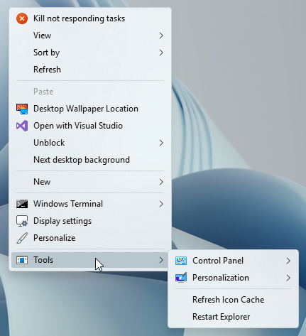

<h1 align="center" id="tools-menu-for-windows-11-desktop-context-menu">Tools Menu for Windows 11 Desktop Context Menu</h1>

<h2 align="center" id="supported-tools">Tools</h2>
<ul align="left">
<li align="left">Restart Explorer</li>
<li align="left">Refresh Icon Cache</li>
<li align="left">Classic Personlization Menu</li>
<li align="left">Control Panel Menu</li>
</ul>
<h3 align="center" id="installation">Installation</h3>

To install simply <a href="https://github.com/The-Back-Room/Tools-Menu-for-Windows-11-Desktop-Context-Menu/archive/refs/heads/main.zip">download this repo</a> and extract the <code>Tools</code> folder into the root of your system drive. <code>C:\</code>. Once done simply double-click the <code>Add Tools Menu to Desktop Context Menu.reg</code> file and you're done.

 

To remove simply double-click the <code>Remove Tools Menu from Desktop Context Menu.reg</code> file.

</ul>