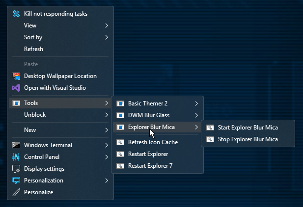
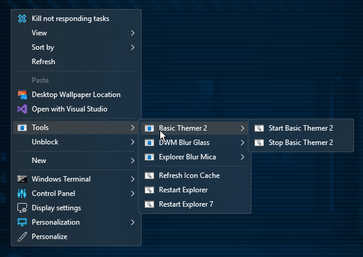
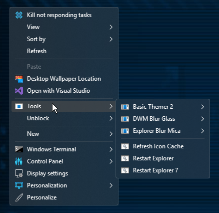
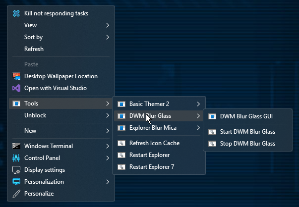

<h1  align="center" id="tools-menu-for-windows-11-desktop-context-menu">Tools Menu for Windows 11 Desktop Context Menu</h1>

This menu grants quick use of some useful tools for desktop customizers.

   
  
<h2 align="left" id="supported-tools">Supported Tools</h2>

Here is a list of currently supported tools. <em>(This list is NOT final. More tools will be added over time.)</em>

<ul align="left" >
<li align="left" >DWMBlurGlass Menu</li>
<li align="left" >ExplorerBlurMica Menu</li>
<li align="left" >BasicThemer2 Menu</li>
<li align="left" >Restart Explorer</li>
<li align="left" >Restart Explorer7</li>
<li align="left" >Refresh Icon Cache</li>
</ul>
<h2 align="left" id="planned-tools">Planned Tools</h2>

Here is a short list of planned tools that currently are NOT supported. <em>(This is not final, This list can and wil be updated if I come across more tools that would fit the purpose of this menu.)</em>

<ul align="left" >
<li align="left" >Proper menu icons for each tool and/or program</li>
<li align="left" >OpenGlass Menu</li>
<li align="left" >Classic Personlization Menu</li>
<li align="left" >Mica for Everyone Menu</li>
</ul>
<h3 align="left" id="installation">Installation</h3>

For this to work as intended <em>(without having to edit the menu paths)</em>, you will need to download this repo and extract the <code>Tools</code> folder into the root of your system drive. <code>C:\</code>. Once done you can choose to use the included subfolders for each supported program as the root folders for them, or edit the <code>set INSTALL_DIR=</code> string in the <code>.cmd</code> files located inside the <code>Scripts</code> sub directory.

  
<h2 align="center" id="important-notes">Important Notes</h2>
<ul align="left" >
<li align="left" >Do NOT edit anything in the <code>Scripts\res</code> subdirectory unless you know what you are doing. That is reserved for command functions that require a seperate batch file and will break if modified.</li>
<li align="left" >The included program subfolders include shortcuts to the downloads for each program that this menu supports.</li>
</ul>