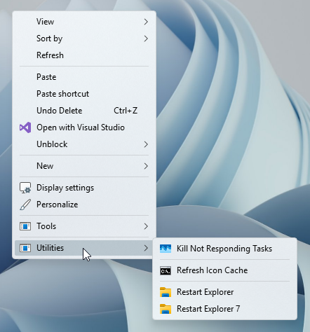

<h1 align="center" id="tools-menu-for-windows-11-desktop-context-menu">Tools and Utilities Menus for Windows 11 Desktop Context Menu</h1>

 

<h4 align="left" id="tools-menu">Tools Menu</h4>
<li align="left">Classic Personlization Menu</li>
<li align="left">Control Panel Menu</li>
<li align="left">MicaForEveryone Menu | Addon</li>
<li align="left">Old New Explorer | Addon</li>
<li align="left">DWMBlurGlass | Addon</li>
</ul>
<h4 align="left" id="utilities-menu">Utilities Menu</h4>
<ul align="left">
<li align="left"><h3 align="left" id="kill-not-responding-tasks-sub-menu">Kill Not Responding Tasks</li>
<li align="left">Refresh Icon Cache</li>
<li align="left">Restart Explorer</li>
<li align="left">Restart Explorer 7 | Addon</li>
</ul>
<h4 align="left" id="micaforeveryone-sub-menu">MicaForEveryone Sub Menu</h4>
<ul align="left">
<li align="left">Start MicaForEveryone</li>
<li align="left">Stop MicaForEveryone</li>
</ul>
<h4 align="left" id="control-panel-sub-menu">Control Panel Sub Menu</h4>
<ul align="left">
<h3 align="left" id="category-sub-menu">Category</li>
<li align="left">All Items</li>
<li align="left">All Tasks (God Mode)</li>
</ul>
<h4 align="left" id="classic-personnalization-sub-menu">Classic Personalization Sub Menu</h4>
<ul align="left">
<li align="left">Theme Settings</li>
<li align="left">Color and Appearance</li>
<li align="left">Desktop Background</li>
<li align="left">Desktop Icon Settings</li>
<li align="left">Mouse Pointers</li>
<li align="left">Notification Area Icons</li>
<li align="left">Screen Saver Settings</li>
</ul>
<color="red"<h3 align="center" id="tip">Note</h3>
<em>
The <code>Explorer 7</code>, <code>DWMBlurGlass</code>, and <code>Old New Explorer</code> options are called on from subdirectories located inside the Tools/src subfolder. Files have been included for compatibility; however, you may need to update them for your own usage. 
The <code>MicaForEveryone</code> menu relies on the MSI variation that is installed in a system location, as such it doesn't specify the location but instead the <code>MicaForEveryone.App.exe</code> process created by the MSI installation method. For this reason, manual installations of MicaForEveryone might not be compatible with this menu. 
Due to Windows context menu limitations, addons may remove entrees from some of the sub menus in order to make space. Keep in mind that if you want to use all of the addons with both menus the Theme Settings option in the Classic Personalization sub menu may disappear.
</em>
<h3 align="left" id="installation">Installation</h3>
<ul align="left">
<li align="left">To install simply download the archive and extract the <code>Tools</code> folder into the root of your system drive; <code>C:\</code>.</li>
<li align="left">To add the Tools menu to your desktop context menu, simply double-click the <code>Add Tools Menu to Desktop Context Menu.reg</code> file.</li>
<li align="left">To add the Utilities menu to your desktop context menu, simply double-click the <code>Add Utilites Menu to Desktop Context Menu.reg</code> file to add the Utilities.</li>
<li>To install the addons, simply double-click the registry file to add whichever addons you want.</li>
</ul>
<h3 align="left" id="uninstallation">Uninstallation</h3>
<ul align="left">
<li align="left">To remove the Tools menu simply double-click the <code>Remove Tools Menu from Desktop Context Menu.reg</code> file.</li>
<li align="left">To remove the Utilities menu simply double-click the <code>Remove Utilities Menu from Desktop Context Menu.reg</code> file.</li>
<li align="left">To remove the addons without removing the Tools or Utilities menus, simply double-click the registry file to remove whichever addons you want to remove.</li>
</ul>

<b>Download</b>: <a href="https://github.com/The-Back-Room/Tools-and-Utilities-Menus-for-Windows-11-Desktop-Context-Menu/archive/refs/heads/main.zip">Download ZIP</a>

</ul>
